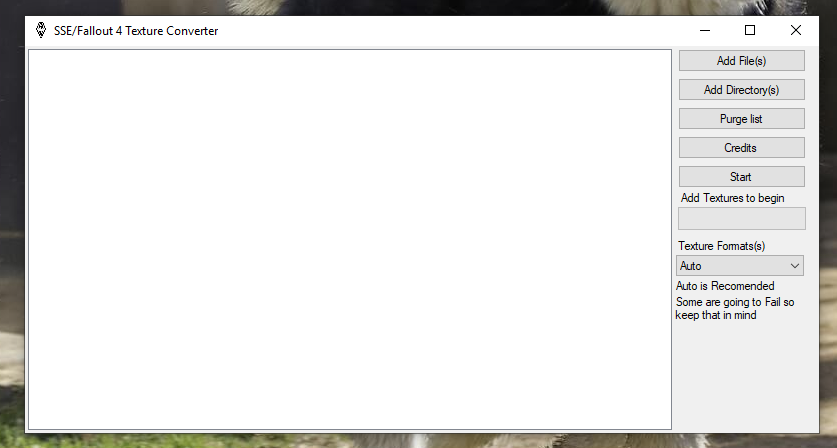

# SSE-Fallout-4-Texture-Converter
Check the changelog.MD for more info
This tool can be used to convert the given ("dds") to GNF

Requirements:

orbis-image2gnf.exe

libSceGnm.dll

libSceGpuAddress.dll

libSceTextureTool.dll

these can be found in the PS4 SDK

location: C:\Program Files (x86)\SCE\ORBIS SDKs\4.500\host_tools\bin

PS4 SDK ("Can't give a link sorry")

though if you have it and don't want to install it you can do this  extract it than got to "InstallFiles[55]" extract the zip file givin and copy

libSceGnm.dll & libSceGpuAddress.dll than go to "InstallFiles[33]" extract the zip file givin and copy libSceTextureTool.dll & 
orbis-image2gnf.exe to the data folder and you are done.

How to install the required files:

step one(1): copy all the required files to the "Data" folder

How to use this tool:
Get the .dds/.tga files (or folder which contains these files).
When adding the .dds/.tga to the tool you have a couple of options, you can click the "Add Files" button to add multiple files by hand, you can click "Add Directory..." which will search the directory you choose for .dds/.tga files, or you can drag the folder containing the .dds/.tga files onto the app and it will automatically scan and detect .dds/.tga files.
Once you have gotten the .dds/.tga files of your choice onto the tool click "Convert" and wait for it to be finished, KEEP IN MIND, With mods with alot of textures and or big textures will take longer.
Questions and answers:

Q What is this tool for?
A This tool converters .dds/.tga files to the file format known as .gnf which is used by default in Skyrim Special Edition and Fallout 4 on PS4.

Q What is .gnf, should I use it?
A .gnf is the format used by default on Skyrim Special Edition and Fallout 4 on PS4. This tool is technically only optional, however it has many advantages. As long as the conversions don't fail (they rarely do for SSE, Fallout 4 is a bit of a mess but slowly being worked on) the .gnf will run better than any .dds/.tga or other texture.

Q This tool just produces another or the same .dds/.tga file, what happened?
A This tool by default converts the .dds/.tga file to .gnf then renames it back, the reason it does this is because Skyrim Special Edition and Fallout 4 are still looking for the extension .dds/.tga, not .gnf, but keep in mind the game is still using .gnf by default, they are just all renamed to .dds/.tga (except a few exceptions).

Q This tool produced a 0 byte .dds/.tga or didn't do anything to the file, what happened?
A While rare, the tool can fail to convert certain textures, I am not aware of any fixes, one possible fix could be to process the .dds/.tga again through a texture editor and seeing if that works with the converter. If all fails then it must be a loose file unfortunately.

You are done use the tool as you wish

